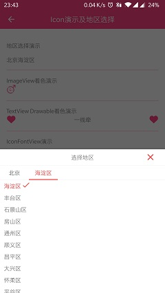
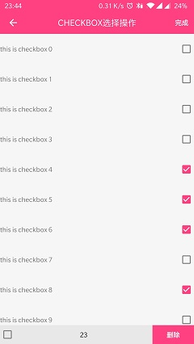

# example-app
- 测试项目  
包含常用第三方框架，以及一些实验性功能  

## 功能说明  
- 继承BottomSheetDialog实现地区选择  
- Iconfont的使用  
- 垂直的ViewPager和主体色  
- RecyclerView和CheckBox选择  
- WebView视频与交互  
- 元素共享动画  
- jsoup解析网页  
  
## 截图展示  

